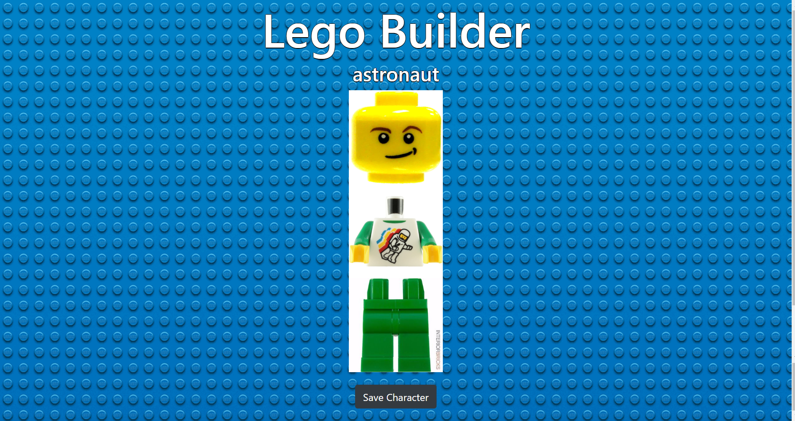
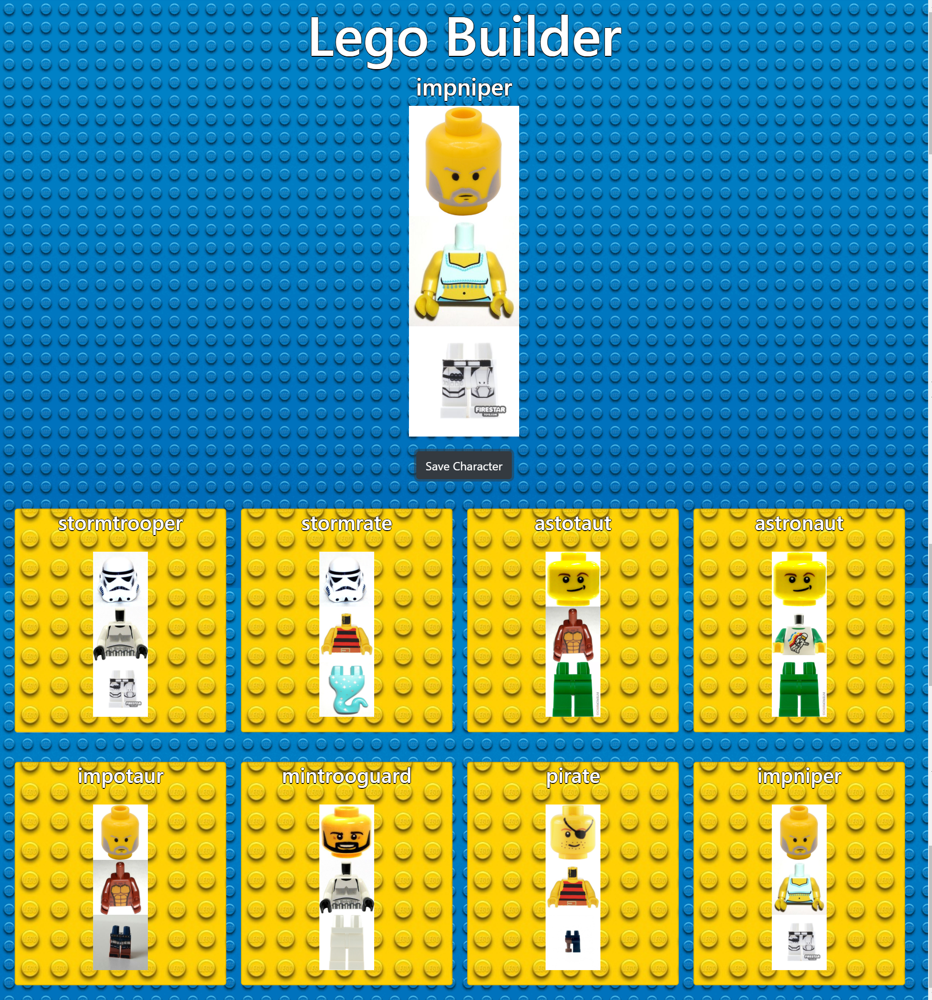

# Lego-Builder
This is an application where you can change the lego parts that are displaying by clicking the images. It also allows you to save your characters. I practiced building promises with axios calls and using sass for the styling.

### How to run this app

1. At the root of the project: `npm install`
2.  `npm start`

### Screenshots

 #### Homepage

#### Saved Characters
